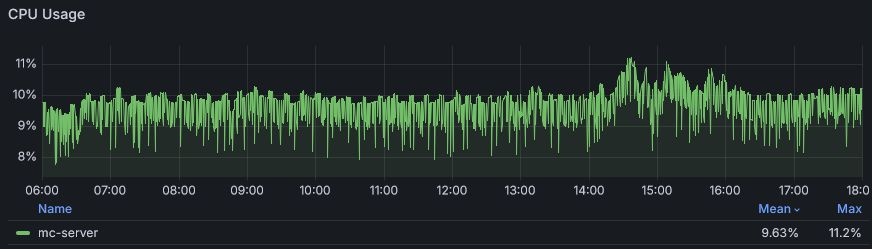
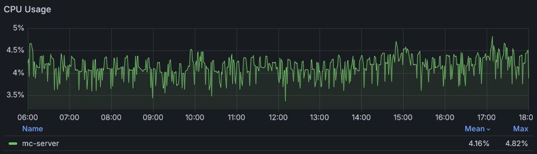

# 1.21.1.1

* Backported [``pause-when-empty-seconds``](https://minecraft.wiki/w/Server.properties)
  * Impact: Depending on what is present in loaded (spawn) chunks this usually leads to a few percent lower idle CPU usage
* Backported fix for [MC-183518](https://bugs.mojang.com/browse/MC-183518)
  * Impact: This can massively lower your (idle) CPU usage when running in a Linux VM
    * As a reference a SMP server hosted on a 2 core ARM VM reduced idle CPU usage from 10% to 5%

### Comparison
Before:

After:

